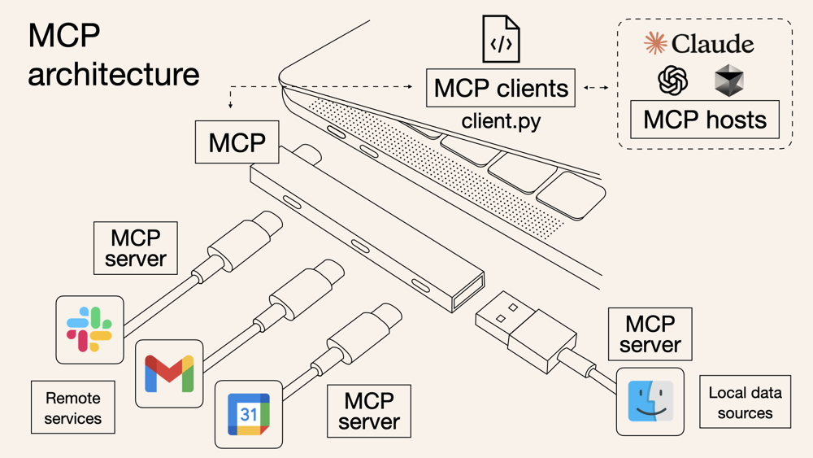

## プレゼン仕様書 — Model Context Protocol (MCP)とは（30分）

最終更新: 2025-10-02

---



### 概要
非エンジニア向けに、Model Context Protocol (以下MCP)とはなにかを直感的に理解して、その理解をもとに自分たちの業務改善を行えるようにデモを通して使い方を理解する

業務で利用する外部サービス（MCPサーバー利用可能）
- **Intercom** - Intercom公式MCPサーバー（2025年5月リリース）
- **Slack** - コミュニティMCPサーバー（korotovsky/slack-mcp-server）
- **GitHub** - 公式MCPサーバー（modelcontextprotocol/servers）
- **Salesforce** - Salesforce DX MCP Server（開発者向けプレビュー）
- **Notion** - Notion公式MCPサーバー（makenotion/notion-mcp-server）
- **Gmail/Google Drive** - Rube（Composio）経由で500+アプリに対応
- **Playwright** - ブラウザ自動化（microsoft/playwright-mcp）

### 対象・前提
- AIツールは日常的に使うが、モデル内部の技術は未学習の非エンジニア。
- PC持参、最新ブラウザ利用可（Chrome/Edge/Safari/Firefox）。
- ローカルで `index.html` を開けること（ネット不調時のオフライン代替手段）。

### 時間
- 合計30分（質疑含む）。

### 学習目標（行動で表現）
参加者が以下のことができるようになる：

1. **MCPの概念を説明できる**
   - USB-Cポートの比喩を使って、非技術者にMCPを説明できる
   - APIとMCPの違いを3つ以上挙げられる

2. **MCPのビジネス価値を理解できる**
   - 自分の業務でMCPが解決できる課題を1つ以上特定できる
   - MCPを使った業務改善アイデアを具体的に1つ以上提案できる

3. **Claude DesktopでMCPを設定・使用できる**
   - Desktop Extensionsまたは手動設定でMCPサーバーをセットアップできる
   - 自然言語でMCPツールを使って簡単なタスクを実行できる

4. **応用的な使い方を理解できる**
   - Playwright MCPを使ったブラウザ自動化の可能性を理解できる
   - 複数のMCPサーバーを組み合わせたワークフローをイメージできる

### 成功指標（評価方法）

#### 即時評価（セッション中）
- **理解度チェック**（挙手・口頭質問）
  - 「MCPをUSB-Cに例えると、何が接続されますか？」→ 80%以上が正解
  - 「APIとMCPの違いを1つ挙げてください」→ 70%以上が回答可能

- **デモ参加度**
  - Claude Desktop設定を試す参加者が50%以上
  - デモ後の質問が3つ以上出る

#### 遅延評価（1週間後）
- **アンケート回答**（後述の項目を参照）
  - MCPの理解度自己評価で平均3.5/5以上
  - 実際にMCPを試した参加者が30%以上

- **行動変容**
  - 業務でMCPを使い始めた事例が1件以上報告される
  - Slackでの質問・情報共有が3件以上発生

### 準備物・環境
- 機材: 進行PC + プロジェクタ、参加者用PC、タイマー。
- 事前設定: `index.html` を各PCに配布／事前に開いておく。

### 勉強会終了後のアンケート項目と理由

#### 1. 理解度評価（5段階）
**質問**: MCPについて、他の人に説明できるレベルで理解できましたか？
- 5: 完全に理解し、他者に説明できる
- 4: よく理解できた
- 3: 概ね理解できた
- 2: 一部理解できた
- 1: ほとんど理解できなかった

**理由**: 学習目標1「MCPの概念を説明できる」の達成度を測定

#### 2. ビジネス価値の認識（5段階）
**質問**: MCPが自分の業務にどの程度役立つと感じましたか？
- 5: すぐに使いたい具体的なアイデアがある
- 4: かなり役立ちそう
- 3: 役立つ可能性がある
- 2: あまり役立たないかもしれない
- 1: 役立たないと思う

**理由**: 学習目標2「MCPのビジネス価値を理解できる」の達成度を測定

#### 3. 実践意欲（選択式）
**質問**: 今後MCPを試してみたいと思いますか？
- すでに試し始めた
- 1週間以内に試したい
- 1ヶ月以内に試したい
- 機会があれば試したい
- 試す予定はない

**理由**: 学習目標3「Claude DesktopでMCPを設定・使用できる」への意欲を測定

---

## アジェンダ

### 1. イントロダクション（5分）
- MCPとは何か：USB-Cポートの比喩で理解
- なぜMCPが必要なのか：業務ツール連携の課題
- 今日学ぶこと：基本と応用の2つのデモ

### 2. デモ1：Claude Desktopで基本を理解（10分）
**目的**: MCPの基本的な仕組みを体験

#### セットアップ方法
1. **Desktop Extensions（最も簡単 - 2025年新機能）**
   - Settings > Extensions を開く
   - `.mcpb`ファイルをクリックしてインストール

2. **手動設定（従来の方法）**
   - Settings > Developer > Edit Config
   - `~/Library/Application Support/Claude/claude_desktop_config.json`を編集
   - MCPサーバー設定を追加して再起動

#### デモシナリオ例
- **Notion連携**: 「先週のミーティングノートを検索して要約して」
- **GitHub連携**: 「リポジトリの最新のissueを確認して」
- **Slack連携**: 「#generalチャンネルの今日のメッセージを要約して」

**重要ポイント**:
- 一度設定すれば、自然言語でツールを使える
- 動的ディスカバリ：MCPサーバーに「何ができる？」と尋ねるだけ
- 複数のツールを組み合わせたワークフローも可能

### 3. デモ2：VS Code + Claude Codeで応用（10分）
**目的**: より高度な自動化をPlaywright MCPで体験

#### セットアップ方法
```bash
# Claude Code CLIを使用（推奨）
claude mcp add playwright "npx @playwright/mcp@latest"

# または VS Code コマンドラインから
code --add-mcp '{"name":"playwright","command":"npx","args":["@playwright/mcp@latest"]}'
```

#### デモシナリオ例
**ウェブサイトの自動テスト**:
```
「playwright mcpを使ってhttps://example.comを開いて、
ログインフォームを見つけて、スクリーンショットを撮って」
```

**データ収集の自動化**:
```
「playwright mcpを使って競合サイトの価格情報を収集して、
Notionに保存して」
```

**重要ポイント**:
- ブラウザ操作を自然言語で指示
- 認証が必要な場合は手動でログイン可能（セッション維持）
- アクセシビリティスナップショットで効率的な操作

### 4. 実践Tips & トラブルシューティング（3分）
- **Windows特有の問題**: `npx`の代わりに完全パス`C:\Program Files\nodejs\npx.cmd`を使用
- **接続エラー**: グローバルインストール `npm install -g @playwright/mcp`
- **セキュリティ**: 信頼できるMCPサーバーのみを使用
- **コスト意識**: 大量のトークンを消費する可能性に注意

### 5. Q&A・まとめ（2分）
- 質疑応答
- 次のステップ：自分の業務でどう使えるか考える

---

## デモ準備チェックリスト

### 事前準備
- [ ] Claude Desktop最新版インストール
- [ ] VS Code + Claude Code拡張機能インストール
- [ ] 各MCPサーバーの認証情報準備
  - [ ] GitHub Personal Access Token
  - [ ] Notion Integration Token
  - [ ] Slack Bot Token
  - [ ] Intercom OAuth（US workspaceのみ）
- [ ] Playwright MCP動作確認
- [ ] デモ用サンプルデータ準備

### デモ時の注意点
- インターネット接続必須
- 認証フローはスキップせず見せる（信頼性の証明）
- エラーが出た場合の代替デモを準備
- 処理時間がかかる場合は事前に録画も用意

---

## 参考リンク

### 公式ドキュメント
- [Anthropic MCP Documentation](https://docs.claude.com/en/docs/claude-code/mcp)
- [Model Context Protocol Official Site](https://modelcontextprotocol.io/)
- [Claude Desktop Extensions](https://www.anthropic.com/engineering/desktop-extensions)

### MCPサーバー
- [公式MCPサーバーリスト](https://github.com/modelcontextprotocol/servers)
- [Awesome MCP Servers](https://github.com/punkpeye/awesome-mcp-servers)
- [Rube by Composio](https://github.com/ComposioHQ/Rube)
- [Playwright MCP](https://github.com/microsoft/playwright-mcp)

### チュートリアル
- [Getting Started with Local MCP Servers](https://support.claude.com/en/articles/10949351-getting-started-with-local-mcp-servers-on-claude-desktop)
- [Using Playwright MCP with Claude Code](https://til.simonwillison.net/claude-code/playwright-mcp-claude-code)